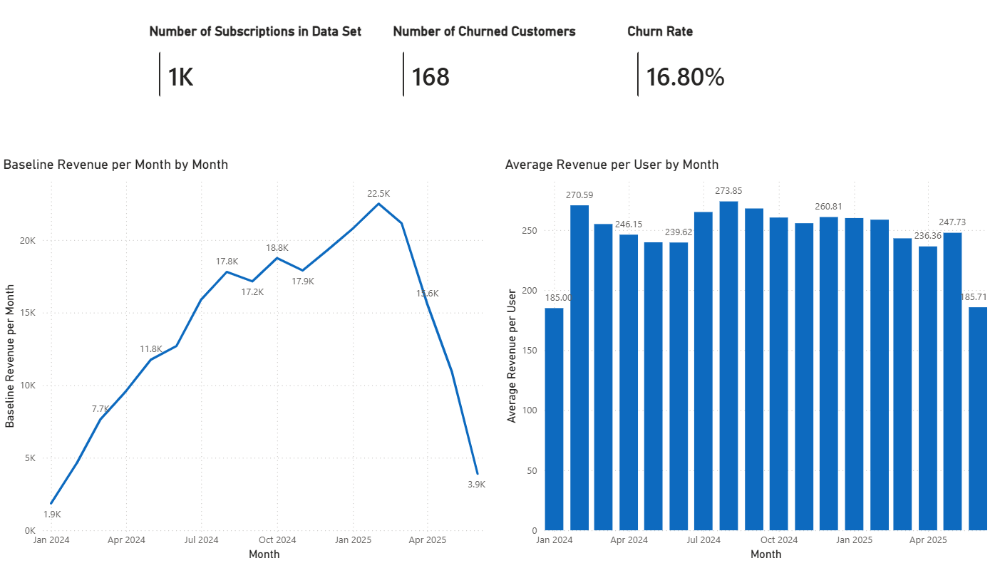
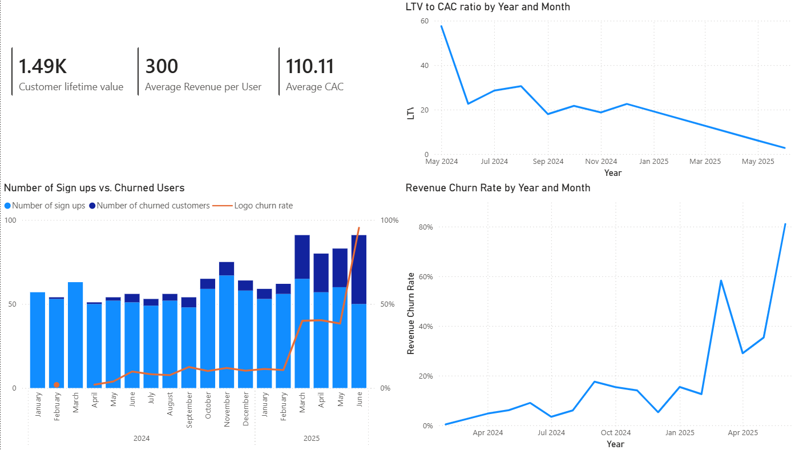

# SaaS Revenue and Loss Metrics

## Project Overview
This data analysis project sources the "SaaS Business Metrics: Customers, Plans & Revenue" dataset from Kaggle.com. The datasets consists of three tables and were analyzed to come up with revenue and loss metrics for the company.

## Dashboard Download
Since the dashboard was created in PowerBI Desktop, a download link will instead be provided to the .pbix file:

[Click here to download the .pbix file]

Clicking the link will download a file which can be opened in PowerBi desktop where the dashboard can be interacted with.

## Dashboard Preview
Below are the sample screenshots of the dashboards:

*This dashboard shows revenue data for the company*

*This dashboard shows loss metrics for the company*

## Key Business Insights
-**Timeline:** The company started off strongly but experienced a sharp decline in revenue starting March. Further investigation is needed on the possible factors affecting this. These could include a rise in the number of competitors, economic changes, substitutes, etc.

-**DAX Measurements:** DAX was used to figure out the customer lifetime value, average revenue per user, and customer acquisition cost, all outlined as key KPIs in the loss dashboard.

## Data Methodology & Tools Used
-**Excel / Power Query:** Used for end-to-end data extraction, transformation, and structural schema validation (ETL).

-**Microsoft Power BI:** Primary data visualization tool used. Also used to further manipulate data and extract other information not present in initial data set (i.e. DAX measurements).
